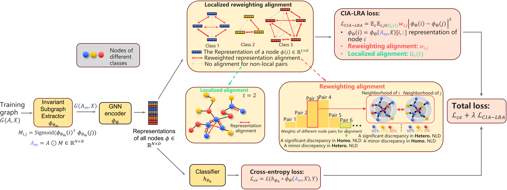

# Dissecting the Failure of Invariant Learning on Graphs

This repository includes a PyTorch implementation of our NeurIPS 2024 paper [Dissecting the Failure of Invariant Learning on Graphs](https://openreview.net/forum?id=7eFS8aZHAM&referrer=%5Bthe%20profile%20of%20Qixun%20Wang%5D(%2Fprofile%3Fid%3D~Qixun_Wang1)). The codebase is adapted from the [GOOD benchmark](https://github.com/divelab/GOOD), which incorporates the implementations of our proposed CIA and CIA-LRA.



## Configuration

### Install the environment 

**Quickly install the environment.**  You can quickly configure the environment you need with conda using the command below. The default environmet name is 'GraphOOD', you could modify it at the first line of the `environment.yml`. 

```bash
conda env create -f environment.yml
```

**Specify the install path.** You could customize the environment installation path by adding the `prefix` entry in `environment.yml`.

```yaml
prefix: path/to/you/env
```


### Prepare the datasets

The datasets are supposed to be automatically downloaded from Web to `./storage/datasets` once you run the code. However, if you have problems automatically downloading the datasets, you can manually download them from the urls provided in `./GOOD/data/good_datasets/good_[dataset].py` (see `self.url = ...`) and put them in `./storage/datasets`.


### Set the hyperparameters for training

The hyperparameter setting is inherited from the GOOD benchmark. Please see this [guideline](./hyperparameter_guideline.md) for how to set the hyperparameter search space.


### The algorithms

The algorithms are located at `./GOOD/ood_algorithms/algorithms`.

#### Minor

* Both CIA and CIA-LRA are implemented in `./GOOD/ood_algorithms/algorithms/CIA.py`. You motifiy the `ood.extra_param[1]` in `./configs/sweep_configs/CIA/base.yaml` to switch between the two algorithms.  0 is for CIA, and 1 is for CIA-LRA.
* The MatchDG is also implemented in `./GOOD/ood_algorithms/algorithms/CIA.py`. To train and evaluate MatchDG, set the `ood.extra_param[1]` of CIA to be 2, and use the command to train and evaluate CIA.


### The GNNs

The GNNs are located at `./GOOD/networks`


## Training & evaluation

After your set the hyperparameters (please see this [guideline](./hyperparameter_guideline.md)), you can start training using the following command. The checkpoints will be automatically saved to the path specified by `ckpt_root:`  in `./GOOD/configs/GOOD_configs/base.yaml`. Evaluation will be simultaneously conducted.

```bash
conda activate pygood
goodtl --sweep_root sweep_configs\
    --launcher MultiLauncher\
    --allow_datasets GOODCora\ # training dataset
     --allow_domains degree\ # dataset-specific training domain
      --allow_shifts covariate\ # concept shift or covariate shift
       --allow_algs CIA\ # training algorithm 
        --allow_devices 6 # GPU id
```


## Collect the evaluation results

Run:

```bash
conda activate pygood
goodtl --sweep_root sweep_configs\
 --final_root final_configs\
  --launcher HarvestLauncher\
   --allow_datasets GOODCora\ # training dataset
    --allow_domains degree\ # dataset-specific training domain
     --allow_shifts concept\ # concept shift or covariate shift
      --allow_algs CIA # training algorithm 
```

This command will sweep over the specified dataset splits and algorithms, and then write the best hyperparameter to `GOOD/configs/final_configs/GOODCora/degree/concept/CIA.yaml`


After that, run:

```bash
conda activate pygood
goodtl --config_root final_configs\
 --launcher HarvestLauncher\
  --allow_datasets GOODCora\ # training dataset
   --allow_domains degree\ # dataset-specific training domain
    --allow_shifts concept\ # concept shift or covariate shift
     --allow_algs CIA\ # training algorithm 
      --allow_rounds 1 2 3 # which random seeds to average the results over
```

This command will print the test accuracy and standard error to the terminal.